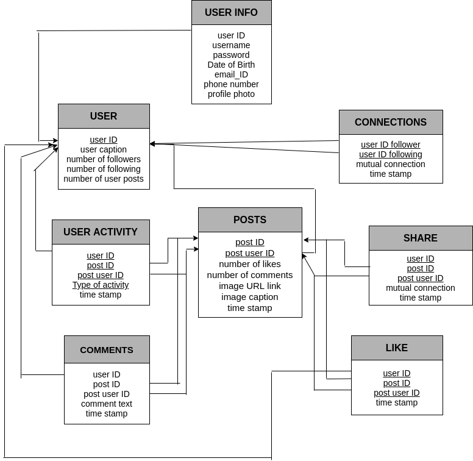

# Database Management System Project

- **Problem Statement**

  - Designing a social media platform.

- **Introduction**

  - Our main objective is to create an online social community for sharing photos.
  - People can interact by posting photos and captions, while others can comment, like and share those posts.

- **Functional Requirements**
  - Tectstack
    - Frontend - HTML, CSS and JavaScript.
    - Backend - Python Flask framework
    - Relational Database - Python SQLite.
  - Use cases -
    - Users can create accounts.
    - Users can follow other users.
    - Users post images and add captions.
    - Users can see the news feeds of people whom they follow.
    - Users can comment and like the posts on their news feed.
    - Users can also share those posts on their own page.

